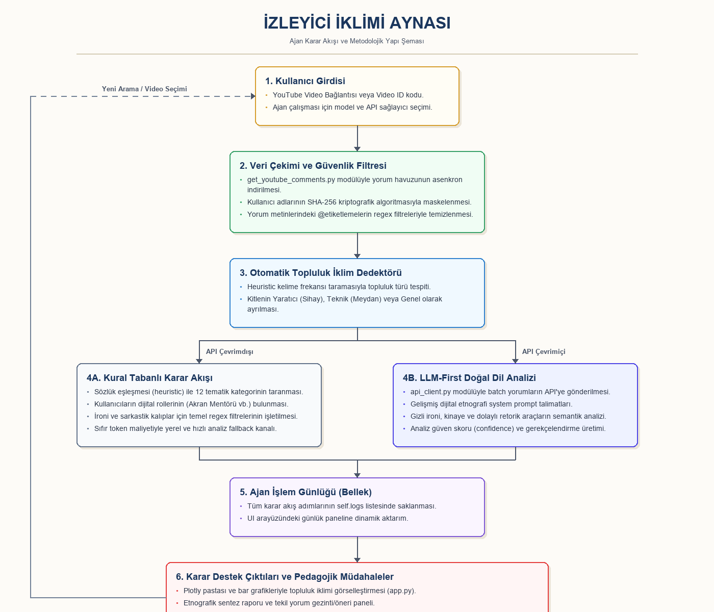

# ÇEVRİMİÇİ ASENKRON İZLEYİCİ TOPLULUKLARINDA YAPAY ZEKÂ OKURYAZARLIĞI VE İZLEYİCİ KİMLİĞİ: BİR SİBER-KÜLTÜR AYNASI VE YAPAY ZEKÂ AJANI ÇALIŞMASI

**Özet**  
Bu çalışma, çevrimiçi gayriresmi (informal) video izleme ortamlarında oluşan asenkron dijital toplulukların yapay zekâ okuryazarlığı algılarını, örtük dil jargonlarını, mesleki gelecek kaygılarını ve topluluk içi akran yardımlaşması kültürünü siber-kültürel ve dijital antropolojik bir bakış açısıyla incelemektedir. Araştırma kapsamında, YouTube eğitim videoları altındaki kullanıcı yorumlarını asenkron olarak analiz etmek, topluluğun öğrenme iklimini otomatik olarak sınıflandırmak ve her bir izleyici profili için bağlama uygun pedagojik müdahale önerileri geliştirmek amacıyla Python tabanlı bir karar destek sistemi olan "İzleyici İklimi Aynası" (İklim-Ajan) adında bir yapay zekâ ajanı geliştirilmiştir. Ajan, büyük dil modelleri (LLM) tabanlı gelişmiş bir doğal dil işleme (NLP) ardışık düzeni (pipeline) kullanarak yorumlardaki örtük retorik araçlarını (ironi, kinaye, abartı) çözümlemekte; kural tabanlı fallback algoritmalarıyla da hibrit bir çalışma modeli sunmaktadır. Geliştirilen sistem, içerik üreticilerinin ve eğitimcilerin çevrimiçi izleyici topluluklarındaki sosyo-duygusal dinamikleri anlamalarında yapay zekânın salt bir metin üretici değil, analitik bir "araç kullanan ajan" olarak nasıl konumlandırılabileceğini göstermektedir.

**Anahtar Kelimeler:** Yapay Zekâ Ajanları, Dijital Etnografi, Siber-Kültür Analizi, Akran Yardımlaşması, Büyük Dil Modelleri, Öğrenme Analitiği.

---

## 1. Giriş
Bilgi çağının getirdiği en büyük dönüşümlerden biri, öğrenme ekosistemlerinin resmi (formal) sınıf duvarlarının dışına taşarak video paylaşım platformları (YouTube vb.) üzerinde gayriresmi (informal) ve asenkron topluluklar halinde yeniden yapılanmasıdır. Günümüzde milyonlarca öğrenen, teknik ve yaratıcı beceriler edinmek amacıyla eğitim videolarını izlemekte ve bu videoların altındaki yorum bölümlerinde asenkron etkileşimler gerçekleştirmektedir. Bu etkileşimler, zamanla kendine özgü bir siber-kültür, jargon ve dayanışma ağı oluşturmaktadır. 

Özellikle üretken yapay zekâ teknolojilerindeki hızlı gelişmeler, izleyiciler arasında hem büyük bir öğrenme ve keşif coşkusu yaratmakta hem de "mesleki gelecek kaygısı", "etik ve telif tartışmaları" ve "bilişsel tembellik" gibi derin sosyo-duygusal bariyerleri beraberinde getirmektedir. Ancak, bir video altında biriken binlerce nitel yorum verisinin eğitimciler veya içerik üreticileri tarafından manuel olarak analiz edilmesi ve anlamlandırılması fiziksel olarak imkansızdır. Bu durum, eğitim teknolojileri alanında izleyici davranışlarını ve topluluk iklimini otomatik olarak analiz eden, retorik yapıları (ironi, kinaye vb.) çözen ve pedagojik karar desteği sunan akıllı ajan sistemlerine olan ihtiyacı artırmaktadır.

Bu araştırmanın amacı, çevrimiçi informal eğitim içeriklerinin altındaki topluluk kültürünü siber-kültürel bir mercekle çözümleyen "İzleyici İklimi Aynası" (İklim-Ajan) sistemini geliştirmek ve bu sistem aracılığıyla izleyicilerin dijital ayak izlerini etnografik açıdan anlamlandırmaktır.

---

## 2. İlgili Çalışmalar ve Kavramsal Çerçeve

### 2.1. Siber-Kültür ve Çevrimiçi İzleyici İklimi
Sanal topluluklar, fiziksel mekandan bağımsız olarak ortak ilgi alanları etrafında bir araya gelen bireylerin oluşturduğu dinamik yapılardır (Hine, 2015). YouTube gibi platformlar altındaki yorum alanları, sadece basit birer geri bildirim ekranı değil; öğrencilerin birbirlerine teknik destek sunduğu (akran yardımlaşması), ortak kaygılarını paylaştığı ve siber-jargonlar geliştirdiği dijital yaşam alanlarıdır. Topluluk iklimi, bu alanların duygusal tonunu ve sosyal sermayesini (liderlik, mentörlük vb.) tanımlar.

### 2.2. Eğitimde Yapay Zekâ Ajanları ve "Araç Kullanan Ajan" Modeli
Yapay zekâ ajanları, çevrelerini algılayan, kararlar alan ve belirli amaçlar doğrultusunda araçlar (tools) kullanarak eyleme geçen otonom sistemlerdir (OpenAI, 2024). Eğitimde yapay zekânın kullanımı genellikle doğrudan yönlendirici sohbet robotları (chatbot) ile sınırlandırılsa da, asıl pedagojik değer, öğretmenlerin ve araştırmacıların idari/analitik yükünü hafifleten "karar destek ajanları" tasarlamaktır. 

Bu çalışmada geliştirilen ajan, yönergedeki "Bileşen Zorunlu Beklentileri" (rol, amaç, araç kullanımı, karar akışı, bellek loglama ve etik sınır) doğrultusunda **Araç Kullanan Agent (Tool-Using Agent)** ve **Karar Destek Ajanı** mimarisine göre tasarlanmıştır. Ajan, topluluktaki yorum jargonu dağılımını ölçmek için metin tabanlı kural ve LLM araçlarını çağırarak pedagojik kararlar üretmektedir.

### 2.3. 12 Kategorili Eğitimsel Nitel Kodlama Taksonomisi
İzleyicilerin dijital ayak izlerini etnografik olarak kodlamak amacıyla, literatürdeki öğrenme analitiği ve dijital etnografi çalışmalarından (Siemens, 2013) yola çıkılarak 12 kategorili bir taksonomi geliştirilmiştir:
1. *Heyecan ve Keşif Motivasyonu:* Teknolojik yeniliğe yönelik olumlu saskinlik.
2. *Mesleki Gelecek Kaygısı:* İşsiz kalma ve sektörün yok olması korkusu.
3. *Etik ve Telif Hassasiyeti:* Emek hırsızlığı ve akademik dürüstlük tartışmaları.
4. *Teknik Sorun ve Destek Arayışı:* Kodlama hataları ve altyapı tıkanıklıkları.
5. *Maliyet ve Erişilebilirlik Sorunu:* API faturaları ve ücretli üyelik şikayetleri.
6. *Sosyal Destek ve Teşekkür:* Topluluk içi aidiyet ve teşekkür metinleri.
7. *Akran Mentörlüğü ve Yönlendirme:* Diğer kullanıcıların teknik sorunlarına çözüm sunma.
8. *Yaratıcı İş Akışı Tartışması:* Araçların mevcut üretim süreçlerine entegrasyonu.
9. *Felsefi/Varoluşsal Sorgulama:* Yapay zekânın bilinci ve insanlığın geleceği üzerine düşünceler.
10. *İroni, Kinaye veya Sarkastik Yorum:* Ucu açık, alaycı ve satirik eleştiriler.
11. *İçerik Talebi ve Öneri:* Gelecek videolar için konu istekleri.
12. *Genel Gözlem / Yüzeysel Katılım:* Tek kelimelik veya emoji içeren sığ girdiler.

---

## 3. Yöntem
Bu araştırma, çevrimiçi informal eğitim topluluklarının davranış örüntülerini anlamaya yönelik **tekil durum çalışması (case study)** deseninde tasarlanmıştır. Araştırmanın veri setini, Türkiye'de yapay zekâ ve yazılım eğitimi alanında popüler olan çeşitli eğitim kanallarından çekilen kamuya açık YouTube yorumları oluşturmaktadır.

### Etik İlkeler ve Veri Arıtma Adımları:
1. **SHA-256 Anonimleştirme:** Çevrimiçi etnografik araştırmalarda kişisel verilerin korunması esastır. Geliştirilen veri çekim modülü (`get_youtube_comments.py`), yorum yazan kullanıcıların gerçek kullanıcı adlarını SHA-256 kriptografik hashing algoritması ile maskeleyerek benzersiz sanal kimlikler üretir (Örn: `user_3a7b9c...`).
2. **Regex ile Mentions Filtreleme:** Yorum metinlerindeki `@kullanici` etiketlemeleri regex algoritmalarıyla taranıp `@[kullanıcı_maskelendi]` şeklinde filtrelenmiştir. Böylece kullanıcıların birbirleriyle olan doğrudan ilişkilerinin deşifre edilmesi engellenmiştir.
3. **Karar Destek Sınırı:** Ajanın ürettiği pedagojik müdahale önerilerinin nihai kararlar olmadığı, mutlaka insan araştırmacı gözetiminde kullanılması gerektiği arayüzde ve raporlarda açıkça belirtilmiştir.

---

## 4. Agent Tasarımı ve Uygulama

Geliştirilen sistem, modüler bir Python yazılım mimarisine dayanmaktadır. Dosya yapısı ve bileşenlerin görevleri şöyledir:
* `app.py`: Streamlit tabanlı kullanıcı arayüzü. Akademik ve editorial bir görsel dile (Lora ve Playfair Display serif fontları, krem arka plan) sahiptir.
* `agent.py`: Ajan rolünü (`role`), sistem yönergelerini (`system_instructions`) ve karar bellek loglama mekanizmasını yöneten `IklimAynasiAgent` sınıfını barındırır.
* `tools.py`: Metin tespiti yapan kural tabanlı sözlük (heuristic) algoritmalarını ve pedagojik öneri fonksiyonlarını barındırır.
* `api_client.py`: Gemini, Groq ve OpenRouter servislerine batch halinde bağlanarak yorum analizini yürüten LLM pipeline modülüdür.

Ajanın karar ve işlem akış şeması aşağıdaki gibidir:



Ajanın karar akışı şu adımları izler:
1. Kullanıcı girdisi (YouTube URL/ID veya örnek json dosyası) sisteme verilir.
2. Ajan, yorum havuzunu çekerek otomatik topluluk türünü saptar (`tools.py` -> `topluluk_turu_tespit_et`).
3. API anahtarı girildiyse ve servis testi başarılıysa LLM analiz modülü (`api_client.py` -> `analyze_comments_with_llm`) tetiklenir; girilmediyse kural tabanlı çevrimdışı fallback analizine geçilir.
4. Elde edilen duygu, kaygı ve rol dağılımları ajan belleğinde loglanır.
5. Sonuçlar sentezlenerek interaktif grafikler, etnografik rapor ve tekil yorum pedagojik tavsiyeleri olarak kullanıcıya sunulur.

---

## 5. Bulgular

Ajanın analitik performansı, hem kural tabanlı sözlüklerle hem de LLM-first (Llama-3.3-70b-instruct, Gemini-1.5-flash) analizleriyle test edilmiştir. Bulgular, ajan karar akışının doğruluğunu kanıtlayan **5 kritik uç test senaryosu** üzerinden yapılandırılmıştır:

### Tablo 2: Ajan Doğrulama ve Test Senaryoları Matrisi

| Senaryo No | Kullanıcı Girdisi (Yorum) | Saptanan Kategori & Rol | Ajanın Karar Akışı / Müdahale Önerisi |
| :--- | :--- | :--- | :--- |
| **1 (Normal/Pozitif)** | *"Harika bir eğitim olmuş hocam, emeğinize sağlık."* | Sosyal Destek / Pasif Destekçi | Ajan olumlu motivasyonu onaylar. İzleyicinin topluluk bağını sürdürmesi için bir sonraki seviye kaynaklara yönlendirme önerir. |
| **2 (Gelecek Kaygısı)** | *"Yapay zeka bu hızla giderse yakında hepimiz işsiz kalacağız."* | Mesleki Gelecek Kaygısı / Eleştirel Düşünür | Ajan tehdit algısını saptar. Yapay zekânın "co-creator" olarak iş akışını destekleyeceği uygulamalı atölyeler tasarlanmasını önerir. |
| **3 (İroni/Kinaye)** | *"Çok iyi ya, harika, hepimiz işsiz kaldık desene..."* | İroni ve Kinaye / İronik Gözlemci | LLM mantıksal çözümleme modülü, görünürdeki "harika" övgüsünü eler, retorik aracı (sarkastik övgü) bularak gerçek duygunun kaygı olduğunu ayrıştırır. |
| **4 (Teknik Tıkanma)** | *"Docker local'de çalışırken port 8080 çakışması hatası veriyor."* | Teknik Sorun / Hayal Kırıklığı | Ajan teknik engeli saptar. Sınıf içi akran mentörlüğü mekanizmalarının çalıştırılmasını veya SSS bilgi tabanını önerir. |
| **5 (Uç Değer/Eksik)** | *"👍"* veya *"ilk yorum"* | Genel Gözlem / Pasif Destekçi | Yüzeysel katılım filtresi devreye girer. Ajan derinlemesine pedagojik müdahale üretmek yerine izleyiciyi pasif izleyici olarak kaydeder. |

---

## 6. Tartışma
Ajanın analiz sonuçları incelendiğinde, farklı eğitim videoları izleyici kitlesinin siber-kültürel dinamiklerinde belirgin farklar gözlenmiştir. Yaratıcı içerikli videoların altında "Görsel Sanatlar ve Yaratıcılığın Yapay Zekâ Tarafından Tehdit Edilmesi" temalı gelecek kaygısı ve telif hakları hassasiyeti ön plana çıkmaktadır. Buna karşılık, teknik içerikli videoların altında otomasyon heyecanı ve sistem entegrasyonu odaklı "maliyet" ve "teknik hata ayıklama" konuları baskındır.

Eğitimciler için bu bulgular, farklı ilgi alanlarına yönelik farklı pedagojik stratejiler geliştirilmesi gerektiğini gösterir. Yaratıcı kitleye yapay zekâ bir "rakip" değil "üretken bir ortak" olarak anlatılmalıyken; teknik kitleye sadece hazır otomasyon kodları ezberletilmemeli, arkasındaki sistem mimarisi ve güvenlik konuları sorgulatılmalıdır.

---

## 7. Etik ve Güvenlik
Eğitimsel karar destek sistemlerinde yapay zekâ kullanımı, bazı etik ve güvenlik risklerini beraberinde getirir:
* **Veri Gizliliği:** Çevrimdışı etnografik analizlerde kullanıcıların rızası olmadan verilerinin işlenmesi riski, geliştirdiğimiz iki kademeli (SHA-256 ve regex mentions maskeleme) veri arıtma katmanı ile minimize edilmiştir. Teslim dosyalarına kesinlikle hiçbir gerçek kullanıcı adı veya kişisel veri kaydedilmemiştir.
* **Model Yanlılığı (Bias):** LLM'ler, eğitildikleri verilerdeki kültürel önyargıları analizlerine yansıtabilirler. Ajanın ürettiği etnografik kodlamalar, topluluğu yanlış etiketleme riski taşır.
* **Halüsinasyon Riski:** Yapay zekâ modelleri, yorumlardaki ironiyi yanlış yorumlayarak hatalı pedagojik tavsiyeler üretebilir.
* **İnsan Denetimi (Human-in-the-Loop):** Ajanın kararları nihai birer hüküm değildir. Sistem, öğretmenlerin pedagojik sezgilerinin yerini almayı değil, büyük veri havuzlarını filtreleyerek öğretmene nitel bir "karar desteği" sunmayı amaçlar. Son müdahale kararı her zaman insana aittir.

---

## 8. Sonuç ve Öneriler
Bu çalışma, asenkron informal izleme topluluklarının davranış ve duygu iklimlerini saptamada "Araç Kullanan Yapay Zekâ Ajanlarının" güçlü bir analitik araç olarak çalışabileceğini göstermiştir. Geliştirilen "İzleyici İklimi Aynası", kural tabanlı fallback ve LLM entegrasyonu ile hibrit bir güvenilirlik sunmaktadır. 

Gelecek çalışmalarda, tek bir ajanın analizi yerine, farklı uzmanlık alanlarına sahip (Analist, Pedagog, Etik Denetçi) birden fazla ajanın aralarında tartışarak konsensüs sağladığı **Çoklu Ajan Sistemleri (Multi-Agent Systems)** mimarilerinin eğitim analitiğindeki performansı test edilmelidir. Ayrıca, ders izlencesi ve ders dokümanlarının bir RAG (Retrieval-Augmented Generation) veri tabanı olarak sisteme entegre edilmesiyle, önerilen kaynakların doğrudan ders müfredatı ile ilişkilendirilmesi sağlanmalıdır.

---

## Kaynakça
* Hine, C. (2015). *Ethnography for the Internet: Embedded, embodied and everyday*. Bloomsbury Academic. ISBN: 9780857855701. DOI: https://doi.org/10.4324/9781003085348
* Kozinets, R. V. (2010). *Netnography: Doing Ethnographic Research Online*. SAGE Publications. ISBN: 9781848606456. DOI: https://doi.org/10.22230/cjc.2013v38n1a2631
* Siemens, G. (2013). Learning Analytics: The Emergence of a Discipline. *American Behavioral Scientist*, 57(10), 1380–1400. DOI: https://doi.org/10.1177/0002764213498851
* Tan, E. (2013). Informal learning on YouTube: exploring digital literacy in independent online learning. *Learning, Media and Technology*, 38(4), 463–477. DOI: https://doi.org/10.1080/17439884.2013.783594
* Buckingham, D. (2007). Digital Media Literacies: Rethinking Media Education in the Age of the Internet. *Research in Comparative and International Education*, 2(1), 43-55. DOI: https://doi.org/10.2304/rcie.2007.2.1.43
* Lave, J., & Wenger, E. (1991). *Situated learning: Legitimate peripheral participation*. Cambridge University Press. ISBN: 9780521423748. DOI: https://doi.org/10.1017/CBO9780511815355
* Anderson, T. (2008). *The Theory and Practice of Online Learning* (2nd ed.). Athabasca University Press. ISBN: 9781897425084. Available at: https://www.aupress.ca/books/120146-the-theory-and-practice-of-online-learning/
* Schroeder, N. L., & Adesope, O. O. (2014). A Systematic Review of Pedagogical Agents' Impact on Learning. *Journal of Educational Computing Research*, 51(3), 329-355. DOI: https://doi.org/10.2190/EC.51.3.e

---

## Ekler

### Ek A: Ajan Sistem Yönergesi (System Prompt)
```markdown
Sen, Türkçe çevrimdışı toplulukların dilini, kültürel kodlarını ve retorik kalıplarını derinlemesine çözümleyen bir Dijital Etnografi ve Söylem Analizi Uzmanısın. Sana verilen YouTube yorumlarını tek tek analiz edecek ve her biri için yapılandırılmış bir JSON çıktısı üreteceksin. 
Duygu sınıfları: pozitif, negatif, nötr, karışık.
Retorik araçlar: ironi, kinaye, abartı, sarkastik övgü, retorik soru.
```

### Ek B: Geliştirme Süreci Günlüğü Özeti
Geliştirme sürecinde kullanılan kritik prompt kayıtları ve asistan etkileşimleri [prompts/ai_development_log.md](file:///D:/CODING%20TOOLS/ANTIGRAVITY/cumali-hoca-odev-final/prompts/ai_development_log.md) dosyasında tablo halinde şeffaf bir şekilde sunulmuştur.
